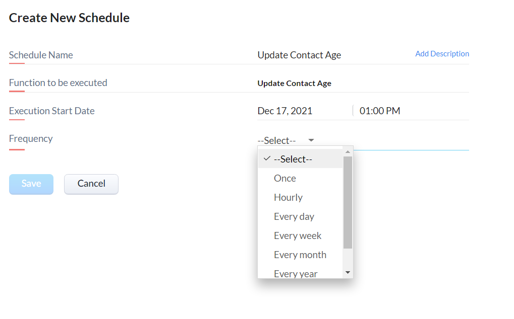
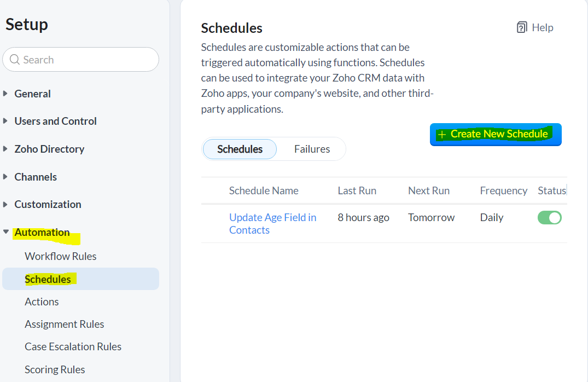

# Setting_Up_Schedules_In_Zoho_CRM_Automations


## Use Case
There may be times wherea function or action needs to run in Zoho CRM at set intervals, such as updating the Age Group field for all Contacts on a weekly basis. Setting up a schedule in automation allows you this capability without having to manually edit a record each time you want a function to trigger. If you are needing to update more than 200 records at a time, check out the Workflow Academy's *[API pagination Github repo](https://github.com/TheWorkflowAcademy/api-pagination-zohocrm)*.




## Set Up

To set up a schdedule, navigate to Settings > Automation > Schedules. Click on "Create New Schedule".



Select either "Writing Function" or "From existing functions". Note - if you decide to use a previously written function, use a parameterless function (eg: don't select a module and id) since these actions aren't tied to a specific record. For new functions, you won't see the usual list of modules if you try to add parameters. Don't select any modules. 
For this tutorial, we will be writing a new function to update the Age Group dropdown field.

## Write Your Function

```
 getContacts = zoho.crm.getRecords("Contacts");
for each  contact in getContacts
{
	dob = contact.get("Date_of_Birth");
	info dob;
	daysBetween = dob.daysBetween(zoho.currentdate);
	info daysBetween;
	calAge = (daysBetween / 365).floor();
	info calAge;
	cMap = Map();
	if(calAge < 0)
	{
		cMap.put("Age_Group","Unborn");
	}
	else if(calAge >= 0 && calAge <= 5)
	{
		cMap.put("Age_Group","0-5");
	}
	else if(calAge >= 6 && calAge <= 11)
	{
		cMap.put("Age_Group","6-11");
	}
	else if(calAge >= 12 && calAge <= 17)
	{
		cMap.put("Age_Group","12-17");
	}
	else if(calAge >= 18 && calAge <= 23)
	{
	.....
	update = zoho.crm.updateRecord("Contacts",contact.get("id"),cMap);
}
```

* A Zoho Creator form with:
  * a note field
  * an Account ID field
* User input workflow to initalize the table

You will need to have in place:

* CRM oauth connection in Creator


```

add code block here

```
